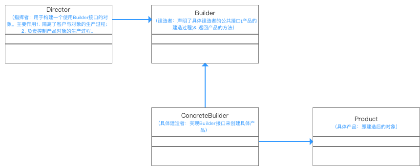

## 前言

这篇主要讲的是设计模式（创建型模式、行为型模式、结构型模式）的创建型模式中的建造者模式，也可以叫 **Builder** 模式。

## 定义

将一个复杂对象的构建与其表示分离，使得同样的构建过程可以创建不同的表示。

创建者模式隐藏了复杂对象的创建过程，它把复杂对象的创建过程加以抽象，通过子类继承或者重载的方式，动态的创建具有复合属性的对象。

## 场景

方便用户创建复杂的对象（不需要知道实现过程）

## 原理

- **UML** 类图



从图中我们主以看出建造者主要分为4种角色：

- **Product**(产品类) :我们具体需要生成的类对象
- **Builder**(抽象建造者类)：为我们需要生成的类对象，构建不同的模块属性，即：公开构建产品类的属性，隐藏产品类的其他功能
- **ConcreteBuilder**(具体建造者类)：实现我们要生成的类对象
- **Director**(导演类)：确定构建我们的类对象具体有哪些模块属性，在实际应用中可以不需要这个角色，直接通过 **client**(客户)处理

- 详解

## 示例

``` ruby

# Builder Design Pattern

class Builder
  # @abstract
  def produce_part_a
    raise NotImplementedError, "#{self.class} has not implemented method '#{__method__}'"
  end

  # @abstract
  def produce_part_b
    raise NotImplementedError, "#{self.class} has not implemented method '#{__method__}'"
  end

  # @abstract
  def produce_part_c
    raise NotImplementedError, "#{self.class} has not implemented method '#{__method__}'"
  end
end

class ConcreteBuilder1 < Builder
  def initialize
    reset
  end

  def reset
    @product = Product.new
  end

  def product
    product = @product
    reset
    product
  end

  def produce_part_a
    @product.add('PartA1')
  end

  def produce_part_b
    @product.add('PartB1')
  end

  def produce_part_c
    @product.add('PartC1')
  end
end

class Product
  def initialize
    @parts = []
  end

  # @param [String] part
  def add(part)
    @parts << part
  end

  def list_parts
    print "Product parts: #{@parts.join(', ')}"
  end
end

class Director
  # @return [Builder]
  attr_accessor :builder

  def initialize
    @builder = nil
  end

  def builder=(builder)
    @builder = builder
  end

  def build_minimal_viable_product
    @builder.produce_part_a
  end

  def build_full_featured_product
    @builder.produce_part_a
    @builder.produce_part_b
    @builder.produce_part_c
  end
end

director = Director.new
builder = ConcreteBuilder1.new
director.builder = builder

puts 'Standard basic product: '
director.build_minimal_viable_product
builder.product.list_parts

puts "\n\n"

puts 'Standard full featured product: '
director.build_full_featured_product
builder.product.list_parts

puts "\n\n"

# Remember, the Builder pattern can be used without a Director class.
puts 'Custom product: '
builder.produce_part_a
builder.produce_part_b
builder.product.list_parts

```

## 优缺点比较

优点：

- 使用建造者模式可以使客户端不必知道产品内部组成的细节。
- 具体的建造者类之间是相互独立的，这有利于系统的扩展。
- 具体的建造者相互独立，因此可以对建造的过程逐步细化，而不会对其他模块产生任何影响。

缺点：

- 建造者模式所创建的产品一般具有较多的共同点，其组成部分相似；如果产品之间的差异性很大，则不适合使用建造者模式，因此其使用范围受到一定的限制。
- 如果产品的内部变化复杂，可能会导致需要定义很多具体建造者类来实现这种变化，导致系统变得很庞大。

## 拓展

项目逻辑 **Bll** 层想针对搜索类型的接口高度封装

## 参考

- https://www.jianshu.com/p/3d1c9ffb0a28

- https://www.douban.com/group/topic/225827430/
